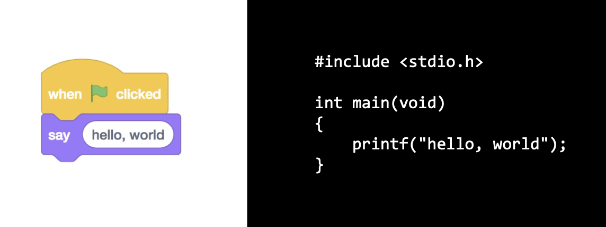
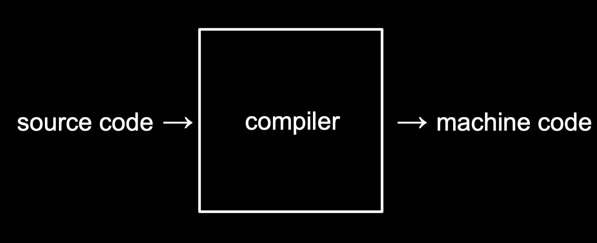
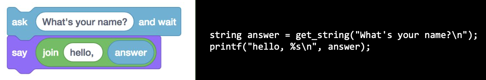

### C 기초


<br>

### 컴파일러



### 문자열

1. 형식지정자
2. string




### 조건문과 루프

1. int
2. if
3. while
4. for

### 자료형, 형식지정자, 연산자

1. char
2. long
3. float
4. double
5. %
6. &&
7. ||

### 짝수인지 홀수인지 알려주는 코드 짜기

```cpp
#include <cs50.h>
#include <stdio.h>

int main(void)
{
    int n = get_int("n: ");

    if (n % 2 == 0)
    {
        printf("even\n");
    }
    else
    {
        printf("odd\n")
    }
}
```

### 사용자 정의 함수, 중첩 루프

### 사용자 정의 함수

```cpp
#include <stdio.h>

int main(void)
{
    for (int i = 0; i < 3; i++)
    {
        printf("cough\n")
    }
}
```
```cpp
#include <stdio.h>

void cough(void);

int main(void)
{
    for (int i = 0; i < 3; i++)
    {
        cough();
    }
}

void cough(void)
{
    printf("cough\n");
}
```

### 중첨 루프

```cpp
#include <cs50.h>
#include <stdio.h>

int main(void)
{
    int n;

    do
    {
        n = get_int("Size: ");
    }
    while (n < 1);

    for (int i = 0; i < n; i++)
    {
        for (int j = 0; j < n; j++)
        {
            printf("#");
        }
        printf("\n");
    }
}
```
