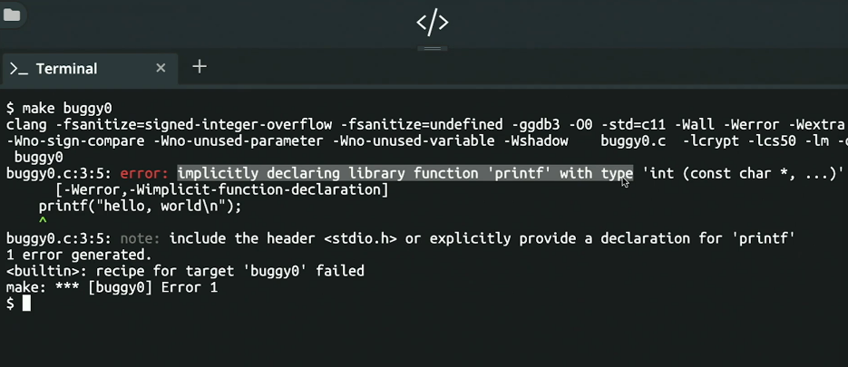

### 1) 컴파일링

```cpp

#include<stdio.h>

int main()
{
	printf("hello, world\n");
}
```
 
 ### 전처리
 
 - 헤드파일을 해당 파일의 실제 코드로 대체시킴
 
 ### 컴파일링
 
 - 소스코드 --> 어셈블리 코드
 
 ### 어셈블링
 
 - 어셈블리 코드 --> 머신코드
	- 0과1로 이루어져 있음
	
### 링킹
- 모든 파일을 이음

### 버그와 디버깅
```cpp

int main()
{
	printf("#\n");
	
	return 0;
}



- 프로그램이 의도된 대로 실행되지 않는 경우
	- #을 10개 출력
```cpp
#include <stdio.h>

int main(void)
{
    for (int i = 0; i <= 10; i++)
    {
        printf("#\n");
    }
}
```
### 디버깅

### 코드의 디자인
- 주석 달기
- 의미 있는 변수명 쓰기
- 이해하기 쉬운 파일명 사용하기

### 배열

```cpp
int main()
{
	char c1 = 'H';
	char c2 = 'I';
	char c3 = '!';
	printf("%c %c %c\n", c1, c2, c3,); 
}
```

> 과제 평균 구하기

```cpp
int main()
{
	 int score1 = 72;
	 int score2 = 73;
	 int score3 = 33;
	 
	 printf("평균은 : &i\n", (score1 + score2 + score3)/3);
}
```


```cpp
int main()
{
	 int scores[3];
	 scores[0] = 72;
	 scores[1] = 73;
	 scores[2] = 33;
	 
	 printf("평균은 : &i\n", (scores[0] + scores[1] + scores[2])/3);
}
```

```cpp

const int N = 3;

int main(void)
{
    // 점수 배열 선언 및 값 저장
    int scores[N];
    scores[0] = 72;
    scores[1] = 73;
    scores[2] = 33;

    // 평균 점수 출력
    printf("Average: %i\n", (scores[0] + scores[1] + scores[2]) / N);
}
```
----------------------
```cpp

float average(int length, int array[]);

int main(void)
{
    // 사용자로부터 점수의 갯수 입력
    int n = get_int("Scores:  ");

    // 점수 배열 선언 및 사용자로부터 값 입력
    int scores[n];
    for (int i = 0; i < n; i++)
    {
        scores[i] = get_int("Score %i: ", i + 1);
    }

    // 평균 출력
    printf("Average: %.1f\n", average(n, scores));
}

//평균을 계산하는 함수
float average(int length, int array[])
{
    int sum = 0;
    for (int i = 0; i < length; i++)
    {
        sum += array[i];
    }
    return (float) sum / (float) length;
}
```

### 문자열과 배열


- 문자열
	- 문자들의 배열

```cpp

string names[4];

names[0] = "EMMA";
names[1] = "RODRIGO";
names[2] = "BRIAN";
names[3] = "DAVID";

printf("%s\n", names[0]);
printf("%c%c%c%c\n", names[0][0], names[0][1], names[0][2], names[0][3]);
```
```cpp
#include <cs50.h>
#include <stdio.h>
#include <string.h>

int main(void)
{
    string s = get_string("Input: ");
    printf("Output:\n");
    for (int i = 0, n = strlen(s); i < n; i++)
    {
        printf("%c\n", s[i]);
    }
}
```
> 소문자 대문자 변환
```cpp

int main(void)
{
    string s = get_string("Before: ");
    printf("After:  ");
    for (int i = 0, n = strlen(s); i < n; i++)
    {
        if (s[i] >= 'a' && s[i] <= 'z')
        {
            printf("%c", s[i] - 32);
        }
        else
        {
            printf("%c", s[i]);
        }
    }
    printf("\n");
}
```

### 명령행 인자

- int main(int argc, strig argv[])
	- 프롬포트에서 바로 실행이 가능
	
```cpp
#include <cs50.h>
#include <stdio.h>

int main(int argc, string argv[])
{
    if (argc == 2)
    {
        printf("hello, %s\n", argv[1]);
    }
    else
    {
        printf("hello, world\n");
    }
}
```
- return


